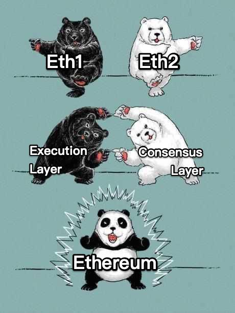

# Consensus Layer News

~~Eth2~~ -> Ethereum Consensus Layer



This is a proxy to the ["Eth2" (Consensus Layer!) news](https://hackmd.io/@benjaminion/eth2_news) by [Ben](https://twitter.com/benjaminion_xyz), with a slight twist: it corrects the naming.

```
# locally:
docker run -dit --net host --name clremap protolambda/clremap:latest --port=5000 --self=http://localhost:5000
```

Disclaimer: eth2.news is a site by Ben, consensuslayer.news is a parody.

